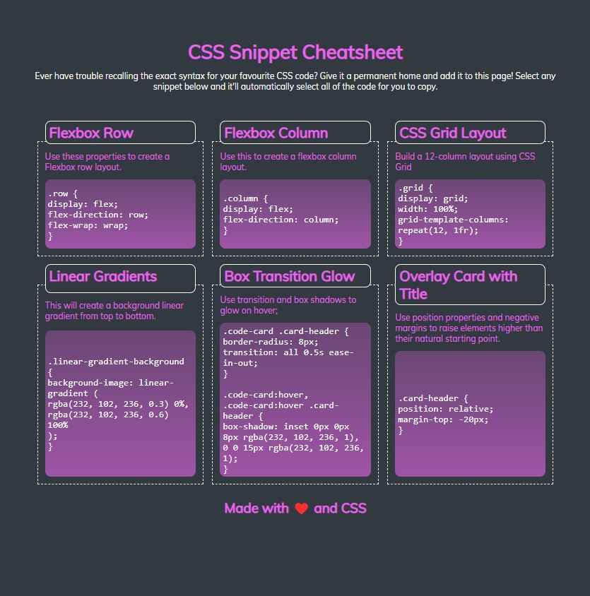

# CSS Snippet Cheat Sheet

## Description

This project was introduced in bootcamp as a demonstration of responsive design and flexbox. I wrote this app in HTML/CSS/Javascript based on the mockup to illustrate the convenience of flexbox. It solves the problem of responsive design efficiency and I learned about difficult concepts like flex value.

## Usage

Click on [CSS Snippet Cheatsheet](https://leoelicos.github.io/bcs-02-mini-project/) to open it in a browser.

Screenshot:

## Credits

Chrome Developer Tools

## License

&copy; Leo Wong <leoelicos@gmail.com>

Licensed under the [MIT License](./LICENSE.txt).

---
